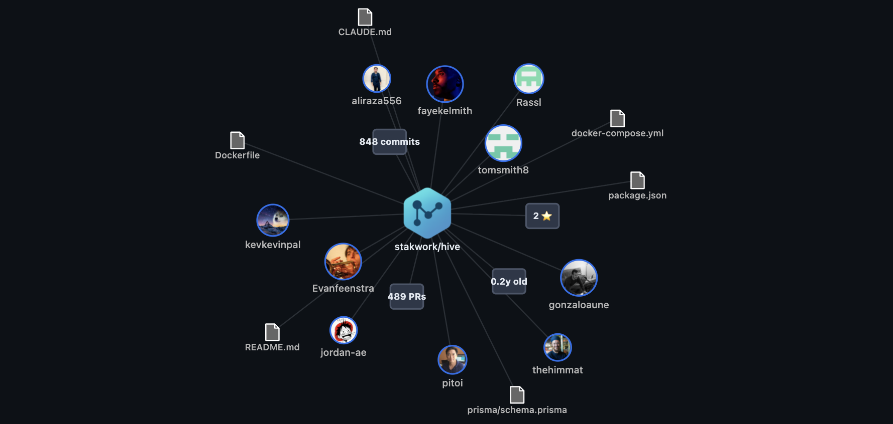

# GitSee

Interactive repository visualization library with D3.js.



## Architecture Overview

### Core Classes

#### Client-Side (`/client/`)

**`GitVisualizer`** - Main orchestrator class
- Creates and manages the D3.js visualization canvas
- Handles API communication and data fetching
- Coordinates timing and animations between different visualization layers
- Manages the detail panel system

**Visualization Resources** (`/client/resources/`)
- **`RepositoryVisualization`** - Renders the central repository node with avatar/icon
- **`ContributorsVisualization`** - Creates contributor nodes with avatars and contribution counts
- **`FilesVisualization`** - Displays key files (package.json, README, etc.) with click-to-view content
- **`StatsVisualization`** - Shows repository statistics as interactive boxes (stars, PRs, commits, age)
- **`LinksVisualization`** - Draws connecting lines between related nodes

**Panel System** (`/client/panel/`)
- **`DetailPanel`** - Floating side panel for detailed node information
- Supports different content types: text, stats grids, and syntax-highlighted code
- Dynamic content loading with GitHub API integration for file contents

#### Server-Side (`/server/`)

**`GitSeeHandler`** - Main API request processor
- Orchestrates data fetching from multiple GitHub endpoints
- Handles caching, rate limiting, and error management
- Supports configurable authentication and private repository access

**Resource Modules** (`/server/resources/`)
- **`RepositoryResource`** - Fetches basic repository information
- **`ContributorsResource`** - Gets contributor data with avatar URLs
- **`FilesResource`** - Discovers key files and fetches their contents
- **`StatsResource`** - Calculates repository statistics (PRs, commits, age)
- **`IconsResource`** - Retrieves repository avatars and organization icons

**Utilities**
- **`GitSeeCache`** - Intelligent caching system with TTL support
- **`RepoCloner`** - Background repository cloning for advanced analysis

### Data Flow

1. **`GitVisualizer`** makes API request to **`GitSeeHandler`**
2. **Handler** coordinates **Resource** modules to fetch GitHub data
3. **Client** receives data and creates **Visualization** instances
4. **Visualizations** render nodes with organic positioning and collision detection
5. **User clicks** trigger **DetailPanel** with dynamic content loading

## Usage

### Client-Side

```html
<div id="viz" style="width: 800px; height: 600px;"></div>
<script type="module">
  import { GitVisualizer } from "./dist/index.js";

  const viz = new GitVisualizer("#viz");
  viz.visualizeRepository("owner/repo-name");
</script>
```

### Server-Side API

```bash
# Start server
yarn dev

# Get repository data (POST request)
curl -X POST http://localhost:3000/api/gitsee \
  -H "Content-Type: application/json" \
  -d '{
    "owner": "stakwork",
    "repo": "gitsee", 
    "data": ["repo_info", "contributors", "stats", "files"]
  }'
```

### Environment

```bash
# .env
GITHUB_TOKEN=your_token
LLM_PROVIDER=anthropic
ANTHROPIC_API_KEY=your_key
```

## Framework Integration

### React

```jsx
function RepoViz({ owner, repo }) {
  const ref = useRef();

  useEffect(() => {
    const viz = new GitVisualizer(ref.current);
    viz.visualizeRepository(`${owner}/${repo}`);
    return () => viz.destroy();
  }, [owner, repo]);

  return <div ref={ref} style={{ width: "100%", height: "600px" }} />;
}
```
